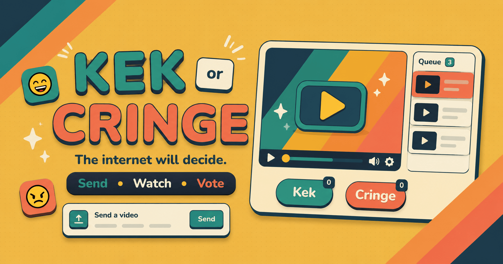

# Kek or Cringe

<a href="#">
  </a>
<a href="https://virtualzer0.github.io/KekOrCringe/" alt="Website">
  </a>
<a href="https://vuejs.org" alt="VueJS">
  </a>
<a href="LICENSE">
  </a>


### 


## 👁‍🗨 About

**Kek or Cringe** is a free, browser-based mediashare game for Twitch streamers. Your viewers drop YouTube, TikTok, or Twitch clip links into chat, and the chat decides — together — whether each video is **kek** or **cringe**. Lose the vote and the video gets skipped.

It runs entirely in your browser. No backend, no signup, no installation — just open the page, type your channel name, and go.

**👉 Try it now: [virtualzer0.github.io/KekOrCringe](https://virtualzer0.github.io/KekOrCringe/)**


## ✨ Features

- 🎬 **Three video sources** — YouTube, TikTok, and Twitch clips, all in one embedded player
- 💬 **Three ways to submit** — chat messages, channel point rewards, or Bits cheers
- 👍 **Custom vote variants** — go beyond "kek" and "cringe" with your own options (and your own emote-driven keywords)
- ⏭ **Cringe-to-skip mechanic** — every cringe vote chips away at a skip counter; kek votes push it back up. Hit zero and the round ends early
- 📊 **Live and all-time stats** — track per-video and per-session results across runs
- 🎨 **Custom variant colors** — pick the accent color used for each vote option
- 🌍 **Bilingual UI** — English and Russian
- 💾 **Everything persists locally** — your settings live in `localStorage`, nothing leaves your machine


## 🕐 Quick Start

1. **Open [the app](https://virtualzer0.github.io/KekOrCringe/)** in your browser.
2. **Enter your Twitch channel name** on the main screen and continue to settings.
3. **Pick a submission method** — chat messages (free), channel point rewards (recommended if you have them), or Bits.
4. **Tweak the video settings** — starting duration per video, how many cringe votes can skip it, which platforms are accepted.
5. **Start the run** — paste a video link in your own chat as a test, then let your viewers take over.


## 🎮 How it works

When you start a run, the app connects to your Twitch chat read-only via [tmi.js](https://github.com/tmijs/tmi.js) — no auth, no permissions, no token. From there:

- Viewers post a video link (or use the reward/Bits trigger you picked). The app detects YouTube/TikTok/Twitch URLs, fetches the title and duration, and queues it.
- While a video plays, chat votes with the keywords you configured — by default `kek` and `cringe`, plus any custom variants you added.
- Each video starts with a **skip counter**. Cringe votes decrease it, kek votes push it back up. When it hits zero, the round ends early.
- When the round ends — by skip-counter or by the video finishing — the winning side gets the credit, stats update, and the next video is pulled from the queue.

**A few notes on the vote logic:**
- The `kek` and `cringe` variants are permanent and can't be deleted — stats and the strong-win check reference them by name.
- A "strong" win means a full shutout: the winning side got votes and **every other variant got zero**.
- A tied `kek`/`cringe` result that no custom variant beats is recorded as **neutral** — counted toward the total video count, but not credited to either side.
- Users can change their mind: a new vote from the same user replaces their previous one.


## 🌐 Supported video platforms

| Platform        | What's supported                                  | Notes                                                        |
| --------------- | ------------------------------------------------- | ------------------------------------------------------------ |
| **YouTube**     | Full videos and Shorts                            | Uses the YouTube Data API for metadata                       |
| **TikTok**      | Full URLs and shortlinks (`vm.tiktok.com`, etc.)  | Shortlinks are resolved via public CORS proxies — flaky links may fail to embed |
| **Twitch**      | Clips only (not VODs or live streams)             | Embeds require the page to be served from a hostname Twitch recognises (works on `localhost` and on the GitHub Pages deploy) |

A built-in word filter rejects videos with flagged words in the title — it can be toggled per run.


## 🛠 Project setup

You don't need to clone anything to use the app. This section is only for running it locally or contributing.

```bash
npm install
```

**Compiles and hot-reloads for development**

```bash
npm run dev
```

**Compiles and minifies for production**

```bash
npm run build
```

**Lints and fixes files**

```bash
npm run lint
```

**Type-check**

```bash
npm run type-check
```


## 🧰 Tech stack

- **[Vue 3](https://vuejs.org/)** + **TypeScript** + **[Vite](https://vitejs.dev/)**
- **[Pinia](https://pinia.vuejs.org/)** for state, with manual `localStorage` persistence
- **[Tailwind CSS v4](https://tailwindcss.com/)** + **[shadcn-vue](https://www.shadcn-vue.com/)** for the UI
- **[vue-i18n](https://vue-i18n.intlify.dev/)** for English/Russian
- **[tmi.js](https://tmijs.com/)** for Twitch chat
- **[Howler.js](https://howlerjs.com/)** for SFX


## ❔ FAQ

- **Does it need any Twitch permissions or login?**

  No. The app connects to chat read-only as an anonymous user. It can't post, ban, or read anything you wouldn't see as a regular viewer.

- **Where is my data stored?**

  Entirely in your browser's `localStorage`. Settings, statistics, and the active video queue never leave your machine. Clearing site data resets everything.

- **A TikTok or Twitch link won't load — what happened?**

  TikTok shortlinks are resolved through public CORS proxies that occasionally go down; if one fails, the app tries the next one. Twitch clip embeds require a recognised hostname (raw IP addresses won't work). YouTube failures are usually region-blocked or age-restricted videos.

- **Can I add a new video platform?**

  Yes — each platform is an adapter in `src/utils/videoSources/`. Implement `IVideoSourceAdapter` from `types.ts`, register it in `index.ts`, and add the key to `VideoPlatform`.

- **Can I add my own vote categories?**

  Yes. In settings you can add as many custom variants as you want, each with their own keyword, color, and skip modifier. Custom variants participate in voting but only win the round if they outvote both `kek` and `cringe`.


## 💥 Errors and suggestions

Found a bug or have an idea? Open an issue here:
[https://github.com/VirtualZer0/KekOrCringe/issues/new/choose](https://github.com/VirtualZer0/KekOrCringe/issues/new/choose)


## 📄 License

This project is licensed under the **GNU General Public License v3.0**. See [LICENSE](LICENSE) for details.
